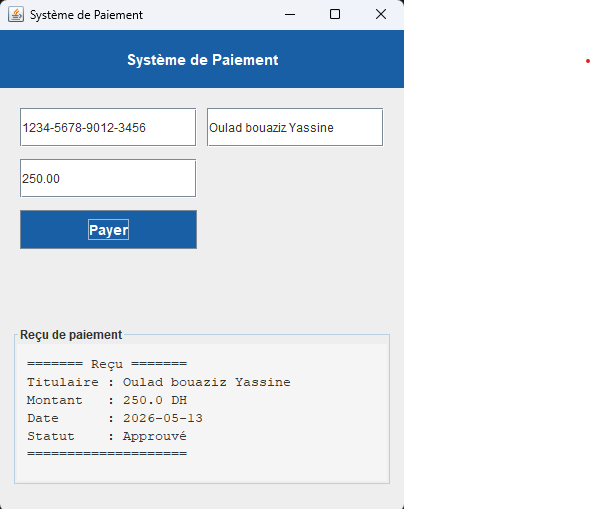

# Payment System — Java

Mini système de paiement en Java illustrant les concepts de :
- Interface
- Classe interne (inner class)
- Organisation en packages

## Structure

src/
├── payment/
│   ├── PaymentMethod.java      # Interface
│   └── CreditCardPayment.java  # Implémentation + classe interne Receipt
└── Main.java                   # Point d'entrée

## Compilation et exécution

```bash
cd src
javac payment/PaymentMethod.java payment/CreditCardPayment.java PaymentGUI.java
java PaymentGUI
```

## Fonctionnalités
- Interface graphique Swing
- Formulaire de saisie (carte, titulaire, montant)
- Affichage du reçu dans la fenêtre

## Exemple de sortie

